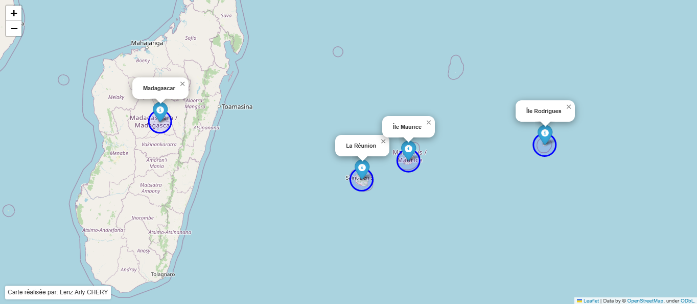

# 🌞 Reunion Solar Analysis

[](https://doi.org/10.5281/zenodo.21708005)
[](LICENSE)


**Spatial analysis of Global Horizontal Irradiance (GHI) and identification of optimal solar zones across Reunion Island using Python geospatial workflows.**

This repository provides a fully reproducible geospatial workflow for analysing the spatial distribution of solar potential over Reunion Island using **Global Solar Atlas** raster data and Python open-source geospatial libraries (`rioxarray`, `rasterio`, `geopandas`, `shapely`).

---

## 📚 Scientific context

This repository is part of the research work conducted for the Master's thesis:

> **Chéry, L. A. (2025).**  
> *Utilisation de l'énergie solaire pour la cuisson du riz à La Réunion : évaluation du potentiel solaire à partir d'expériences de cuisson et de données satellitaires.*  
> Master's thesis, Université Paris-Saclay.  
> Supervisor: Agnès Ricroch.

The thesis investigates the potential of solar energy for rice cooking applications in Reunion Island by combining:

- experimental solar cooking measurements;
- solar resource assessment based on Global Solar Atlas data;
- spatial analysis of solar potential.

This repository focuses exclusively on the **spatial and remote sensing component** of the research.

The experimental cooking workflow, PostgreSQL database and generic geomatics utilities are maintained in separate repositories.

---

## ⭐ Highlights

- 🛰️ Processing of Global Horizontal Irradiance (GHI) data from Global Solar Atlas
- 🗺️ Fully reproducible Python geospatial workflow
- 📡 Raster preprocessing using `rioxarray` and `rasterio`
- 🌋 Island-scale solar resource mapping
- 📊 Extraction and quantification of high solar potential zones
- 🔬 Designed for reproducible scientific research

---

## 📍 Context

Reunion Island is a young volcanic island located in the south-western Indian Ocean (21°07' S, 55°32' E).

Its tropical climate provides a significant solar resource, but strong spatial contrasts exist due to topography:

- highly exposed coastal areas;
- humid highlands;
- mountainous cirques.

Because Reunion Island remains strongly dependent on imported fossil fuels and faces significant domestic energy consumption, particularly for cooking practices, understanding the spatial distribution of solar resources is an important step toward evaluating renewable-energy solutions.

This analysis contributes to the assessment of solar cooking feasibility by identifying areas where theoretical solar potential is highest and where deployment could be relevant.

<p align="center">
  
</p>

<p align="center">
<em>Location of Reunion Island within the Mascarene archipelago (Indian Ocean).</em>
</p>

---

## 🎯 Objectives

This repository aims to:

1. **Reproject and clip** the Global Solar Atlas GHI raster (daily average, 1999-2018) to the administrative extent of Reunion Island.
2. **Map the spatial distribution of GHI** across the whole island.
3. **Identify and quantify high solar-potential zones** (GHI ≥ 5 kWh/m²/day), a threshold recognized in the literature as optimal for solar cooking and photovoltaic applications (Muthusivagami et al., 2008), and cross-reference these zones with the communal (municipality-level) administrative boundaries.

This analysis forms the spatial backbone of the thesis: it makes it possible to bring together theoretical solar potential (satellite data) and areas of high energy demand (urbanized coastline), in order to identify the most relevant territories for deploying solar cooking technologies in Reunion.

---

## 🗂️ Repository structure

```
reunion-solar-analysis/
│   .gitignore
│   CITATION.cff
│   LICENSE
│   README.md
│   requirements.txt
│   reunion_solar.yml
│
├───data
│   ├───raster
│   │       GHI_Reunion.tif
│   │
│   └───vectors
│           README.md
│
├───figures
│       Reunion_Island_Localisation.png
│
├───outputs
│   ├───maps
│   │       commune_centroids.gpkg
│   │       Final_GHI_Distribution_Map.png
│   │       ghi_reunion_clip.tif
│   │       Optimal_Solar_Zones.png
│   │       optimal_zones.gpkg
│   │       reunion_boundary.gpkg
│   │
│   └───tables
│           ghi_statistics.csv
│           optimal_solar_zones_area.csv
│
└───scripts
        01_reproject_clip.py
        02_ghi_distribution.py
        03_optimal_zones.py
```

---

## 🛰️ Data used

| Source | Description | Format | Resolution / Period | Access |
|--------|-------------|--------|---------------------|--------|
| **Global Solar Atlas 3.0** (World Bank Group / Solargis) | Average daily Global Horizontal Irradiance (GHI) | Raster (GeoTIFF) | ~250 m, 1999-2018 average | Available from the [Global Solar Atlas](https://globalsolaratlas.info/download/reunion) under **CC BY 4.0** |
| **GADM v2.8** (Hijmans, 2015) | Second-level administrative boundaries (communes) of Reunion Island | Vector (Shapefile) | Administrative level 2 | Available from the [Stanford Digital Repository](https://purl.stanford.edu/pn417fx4462) for academic and non-commercial use |

---

## 📦 Data and licenses

### Global Solar Atlas (GSA)

The Global Horizontal Irradiance (GHI) data come from **Global Solar Atlas 3.0**, produced by **Solargis** for the **World Bank Group**, released under a **Creative Commons Attribution 4.0 International (CC BY 4.0)** license.

> **Required citation:**
> *Source: Global Solar Atlas 3.0, World Bank Group, 2024. Data provider: Solargis. License: CC BY 4.0.*
> [https://globalsolaratlas.info](https://globalsolaratlas.info)

In accordance with this license, the GHI raster is redistributed, modified, and included in this academic work **provided the source is credited**, which this repository does. Because the file is lightweight, **`GHI_Reunion.tif` is versioned directly in `data/raster/`** for reproducibility - no separate download step is required.

### Administrative boundaries (GADM v2.8, via Stanford Digital Repository)

The commune-level boundaries used to clip the raster and label the maps come from **"Second-level Administrative Divisions, Reunion, 2015"**, part of the **Global Administrative Areas (GADM) v2.8** dataset, created by **Robert J. Hijmans** (University of California, Berkeley, Museum of Vertebrate Zoology; International Rice Research Institute), hosted on the **Stanford Digital Repository**.

> **Citation:**
> Hijmans, R. J. (2015). *Second-level Administrative Divisions, Reunion, 2015* [Shapefile]. Global Administrative Areas (GADM) v2.8. University of California, Berkeley, Museum of Vertebrate Zoology; International Rice Research Institute. Stanford Digital Repository.
> [https://purl.stanford.edu/pn417fx4462](https://purl.stanford.edu/pn417fx4462)

> **License terms (important):** this dataset is *"freely available for academic use and other non-commercial use. Redistribution, or commercial use is not allowed without prior permission."* This is **not** a CC BY or Etalab-style open license.

**Practical consequence for this repository:** because redistribution requires prior permission, the shapefile (`REU_adm2.shp` and its sidecar files) is **not committed** to this public repository, unlike the GHI raster. Instead:

- `data/vectors/README.md` contains the direct download link above; each user retrieves the file themselves under the dataset's own academic-use terms.
- `data/vectors/REU_adm2.*` is listed in `.gitignore`.
- If you need the boundary file bundled directly in a repository (e.g., for a fully offline, one-click clone), contact the data provider (mvz@berkeley.edu) for permission first, or substitute an openly licensed alternative such as France's official IGN ADMIN-EXPRESS commune layer (Licence Ouverte / Etalab 2.0).

---

## ⚙️ Methodology and scripts

| Script | Role | Main outputs |
|---|---|---|
| `01_reproject_clip.py` | Reprojects the GHI raster (WGS 84 → RGR92 / UTM 40S, EPSG:2975) and clips it to the extent of Reunion Island using `rioxarray` (`raster.rio.clip()`) | `outputs/maps/ghi_reunion_clip.tif`, `outputs/maps/reunion_boundary.gpkg` |
| `02_ghi_distribution.py` | Descriptive GHI statistics and spatial-distribution map | `outputs/maps/Final_GHI_Distribution_Map.png`, `outputs/tables/ghi_statistics.csv` |
| `03_optimal_zones.py` | Extraction of zones ≥ 5 kWh/m²/day, vectorization, area computation, and overlay with communes | `outputs/maps/Optimal_Solar_Zones.png`, `outputs/maps/optimal_zones.gpkg`, `outputs/maps/commune_centroids.gpkg`, `outputs/tables/optimal_solar_zones_area.csv` |

**Note on the pipeline:** the raster pre-processing (reprojection and clipping) is performed **entirely in Python** via `rioxarray` and `rasterio`. No step in this version of the repository relies on QGIS.

---

## 💻 Installation

```bash
git clone https://github.com/lenzchery/reunion-solar-analysis.git
cd reunion-solar-analysis

conda create -n reunion_solar python=3.11.15
conda activate reunion_solar

conda install -c conda-forge \
    geopandas rasterio rioxarray xarray gdal

pip install -r requirements.txt
```

Or, using the provided Conda environment file directly:

```bash
conda env create -f reunion_solar.yml
conda activate reunion_solar
```

---

## ▶️ Usage

The GHI raster is already included in `data/raster/`. The commune boundary file is **not** bundled (see "Data and Licenses" above) — download it from [purl.stanford.edu/pn417fx4462](https://purl.stanford.edu/pn417fx4462) and place `REU_adm2.shp` (+ `.dbf`/`.shx`/`.prj`) in `data/vectors/`. Then run the scripts in order:

```bash
python scripts/01_reproject_clip.py
python scripts/02_ghi_distribution.py
python scripts/03_optimal_zones.py
```

---

## 📊 Key results

- GHI across Reunion Island ranges from **1.37 to 5.50 kWh/m²/day** (island-wide average: **4.51 kWh/m²/day**).
- **405.4 km², i.e. 16.1% of the territory**, has a GHI ≥ 5 kWh/m²/day.
- Urbanized coastal areas (Saint-Denis, Saint-Paul, Saint-Pierre, Sainte-Marie, Saint-André) concentrate the optimal solar potential — precisely where energy demand is highest.

> **Methodological note:** the island boundary used for clipping is derived by dissolving the communal layer (`REU_adm2.shp`) into a single polygon, rather than using a separate region-level boundary file. This slightly changes the traced coastline compared to an earlier version of this analysis (which reported 397.4 km² / 15.9%), since the optimal-GHI zone is concentrated right along the coast, where small differences in boundary tracing have a proportionally larger effect. The island-wide total area implied by this boundary (~2,513 km²) is close to the officially reported area of Reunion Island (2,512 km², IGN/INSEE).

---

## 📄 License

See the [LICENSE](LICENSE) file (MIT for the code; datasets remain under their original licenses — see "Data and Licenses" above).

---
## 📖 Citation

If you use this repository in academic work, please cite the software using the `CITATION.cff` metadata file or the DOI below:

> **Chéry, L. A. (2026).** *Reunion Solar Analysis: Spatial Assessment of Global Horizontal Irradiance (GHI) for Solar Cooking Applications* (Version 1.0.2) [Computer software]. Zenodo.  
> https://doi.org/10.5281/zenodo.21708005

Please also cite the associated Master's thesis when referring to the scientific results presented in this repository.

## ✍️ Author

**Lenz Arly Chéry**

Master 2 Développement Agricole Durable - parcours Food Security for Development  
Université Paris-Saclay (2024–2025)

GitHub: https://github.com/lenzchery

---

## 📚 References

- Chéry, L. A. (2025). *Utilisation de l'énergie solaire pour la cuisson du riz à La Réunion : évaluation du potentiel solaire à partir d'expériences de cuisson et de données satellitaires.* Master's thesis, Université Paris-Saclay.
- Global Solar Atlas. (2024). *Global Solar Atlas 3.0.* The World Bank Group / Solargis.
- Muthusivagami, R. M., Velraj, R., & Sethumadhavan, R. (2008). Solar cookers with and without thermal storage — A review. *Renewable and Sustainable Energy Reviews*, 14(2), 691-701.
- Hijmans, R. J. (2015). *Second-level Administrative Divisions, Reunion, 2015* [Shapefile]. Global Administrative Areas (GADM) v2.8. University of California, Berkeley, Museum of Vertebrate Zoology; International Rice Research Institute. Stanford Digital Repository. https://purl.stanford.edu/pn417fx4462
